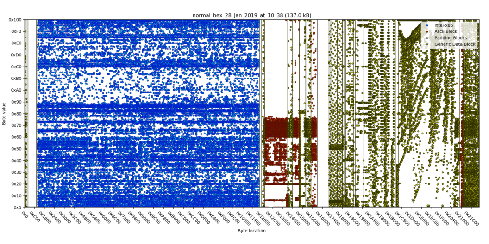
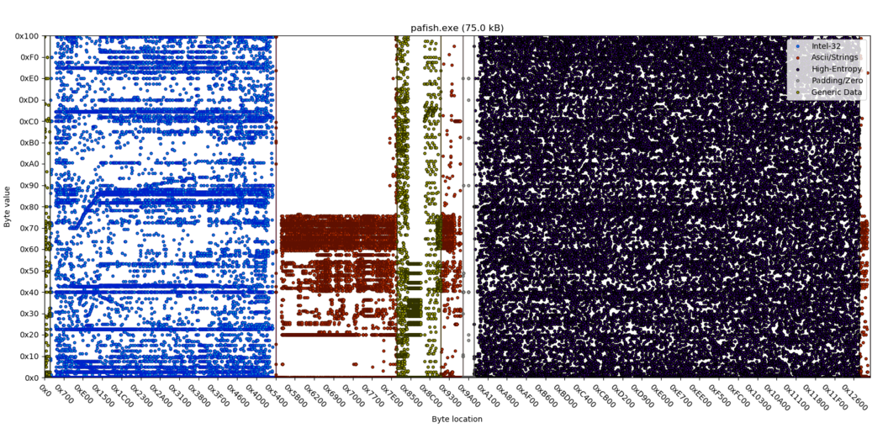
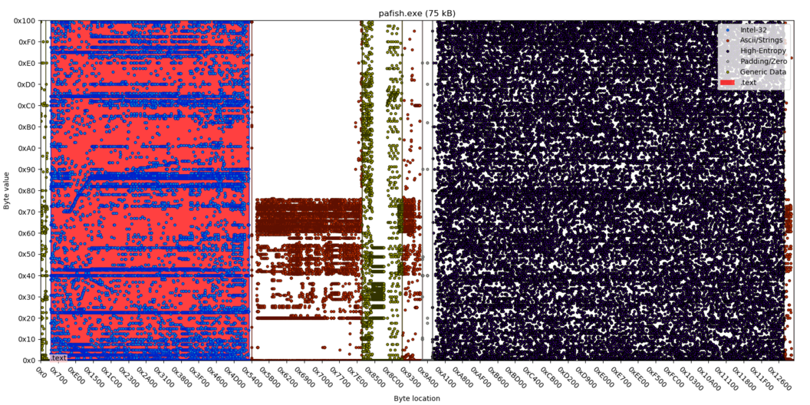

## Codescanner (with Python bindings) ##

The Codescanner detects machine code in files and identifies the cpu architecture, endianness, and bitness.
It can be used against data files (pdf, jpgs, unknown binary files).

Version: 1.3.1
Last changed: 02. Nov 2024

## What this contains

The Python 2/3 analysis framework and the Codescanner core in standalone 
binary form as well as library form, with C/C++ headers. 
The directory `C_lib` contains the C/C++ backend and C headers.

### Author and copyright information ###

Copyright © Fraunhofer-Gesellschaft zur Förderung der angewandten Forschung e.V.    
All rights reserved.

Please read the included LICENSE. This program is free for academic use and research.   
In case you want to use it in a commercial project you can write an email.

###

#### Author and maintainer:
- Viviane Zwanger (Codescanner core, old Python bindings) ([viviane.zwanger@fkie.fraunhofer.de](viviane.zwanger@fkie.fraunhofer.de))
- Henning Braun (Maintainer of the modern Python bindings) ([henning.braun@fkie.fraunhofer.de](henning.braun@fkie.fraunhofer.de))


### Requirements
* Python2 >= 2.7 or Python3 (Warning: Python2 will soon become deprecated.)
* matplotlib
* numpy


### Installation ###
```bash
sudo pip install . 
```
The installation works as well without `sudo` for the current user.


### Deinstallation ###
```bash
sudo pip uninstall codescanner_analysis
```
Skip the `sudo`, if codescanner_analysis was installed without it, i.e. just for the current user.


### Usage ###

#### General ####
```python
from codescanner_analysis import CodescannerAnalysisData as CAD
cad = CAD(filenamepath, (0xstartOffset), (0xendOffset))
cad = CAD(filenamepath)
cad = CAD(filenamepath, 0x100, 0x2000)
```  

#### Print regions (if any) ####
```python
cad.regions.get("Code")
cad.regions.get("Ascii")
cad.regions.get("Data")
cad.regions.get("HighEntropy")
for coderegion in cad.regions.get("Code"): 
    print("Coderegion: 0x%x - 0x%x (%s)" % (coderegion[0], coderegion[1], coderegion[2]))
``` 

#### Print sizes of regions (if any) ####
```python
cad.sizes.get("Code")
cad.sizes.get("Ascii")
cad.sizes.get("Data")
cad.sizes.get("HighEntropy")
cad.sizes.get("FileSize")

for s in cad.sizes: 
    print("%s : %i" % (s, cad.sizes[s]))
``` 

#### get cpu architecture dictionary (empty dictionary, if no code exists) ####
```python
cad.architecture
cad.architecture.get("Full")      # Full Codescanner CPU architecture string
cad.architecture.get("ISA")       # ISA only (e.g., Intel, Arm, etc)
cad.architecture.get("Bitness")   # If relevant.
cad.architecture.get("Endianess") # If relevant.
``` 

#### Plot an image to file ####

There are two different types of plots: **byteplots** that plot each byte 
(cad.BYTE_PLOT alias (1)) and **colormaps** (cad.COLOR_MAP alias (2)). 
Byteplots are generally considered best. For large files colormaps become 
increasingly powerful, since matplotlib has certain limits to how much 
points (bytes) can be plotted on a canvas. 
A typical Codescanner plot of a benign executable is shown below.




```python
dpi = 100  # recommended: dpi=75, 100, 150.
plot_type = cad.BYTE_PLOT  # (1) or cad.COLOR_MAP (2) 
cad.plot_to_file('img/file/name', dpi, plot_type)
cad.plot_to_file('/tmp/a.png', dpi)

# Dynamic-size plots are possible with:

width = 1600
height = 1000
cad.plot_to_dynamic_size_file('/tmp/a.png', dpi, width, height, plot_type)
```   
#### Plot an image to buffer ####
```python
plot_type = cad.BYTE_PLOT  #  (1) or cad.COLOR_MAP (2) 
buffer = cad.plot_to_buffer(dpi, plot_type)
buffer = cad.plot_to_buffer(100)
```  

The buffer can then be used elsewhere. 
For example, it can be encoded to base64 and then be included as an image in an html-sheet. 

##### Use of a COLOR_MAP plot #####
The ColorMap plot may be useful, if the input file is very large, exceeding the plotting capabilities of matplotlib and the users RAM.


#### Standalone usage of ColorMap and ImagePlot ####
The ColorMap and BytePlot classes may be used independently.

### Using the extended **com**parative **a**nalysis (COMA) ###
You may cross check the code regions found by Codescanner by comparing 
them visually with executable-flagged regions ELF/PE header. 
(By default, this is done using Headerparser, or as a fallback, objdump.)
This can be useful to see if the binary has a strange/unusual layout. 
Examples of potential interest: packed/dropper, ROM files, and other manipulation.

```python
from codescanner_analysis.comparison_analysis import ComparisonAnalysis as COMA
coma = COMA(filepathname)

# This will (try to) overlay code regions of header with code regions of Codescanner.
coma.plot_to_file(outpngfile, dpi=xx) # dpi common values: 75 or 100

# Check if code regions from header are inside file (e.g., not true for ROM files or memdumps).
print(coma.are_code_regions_in_file())

# Code regions by Codescanner (Alien regions are code regions only found by Codescanner and not found py parsing the header.)
for r in coma.cs_regions: 
    print("%s : %s" % (r, coma.cs_regions[r]))

# Code regions as found by parsing the header.
for r in coma.x_regions: 
    print("%s : %s" % (r, coma.x_regions[r]))
    
```  

#### Plotting pafish.exe in cad and coma ####

##### pafish.exe (normal 'cad' plot) ##### 




##### pafish.exe ('coma' plot) ##### 
The PE header matches the code region found by Codescanner exactly (red overlay). 
Everything absolutely normal as expected. (This can look different, e.g., malware or dropper...)




